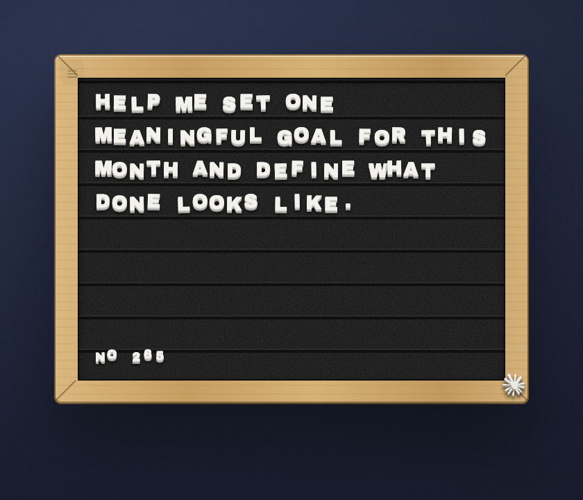

# daily-ai-prompt

> One daily AI prompt on a frosted-glass panel; click to copy and open a new chat.

[](https://github.com/jke48222/daily-ai-prompt-widget/releases/latest) [](LICENSE) 

[Übersicht gallery](https://tracesof.net/uebersicht-widgets/) · [Widget suite](https://github.com/jke48222/widget-suite) · [Download](https://github.com/jke48222/daily-ai-prompt-widget/releases/latest) · [Setup guide](docs/SETUP.md) · [Troubleshooting](docs/TROUBLESHOOTING.md)

A widget for [Übersicht](http://tracesof.net/uebersicht/). The widget itself is
self-contained in `index.jsx`. Out of the box it rotates through a bundled
prompt library; connect it to an AI API — Claude, ChatGPT, or Gemini (below) —
to get a fresh, personalized prompt generated daily.



### On the desktop

The widget running alongside the full set:


[Full-resolution video](media/homescreen.mp4)

## Requirements

- macOS with [Übersicht](https://tracesof.net/uebersicht/) installed (`brew install --cask ubersicht`)
- Optional: an AI API (see below)

## Install

If you don't have Übersicht yet:

```sh
brew install --cask ubersicht
```

**One-click.** Clone the repo and run the installer. It copies the widget into Übersicht's widgets folder, installs any helper scripts, and runs setup if the widget needs it. Safe to re-run.

```sh
git clone https://github.com/jke48222/daily-ai-prompt-widget.git
cd daily-ai-prompt-widget && ./install.sh
```

**Manual.** Download `daily-ai-prompt.widget.zip` from the [latest release](https://github.com/jke48222/daily-ai-prompt-widget/releases/latest), unzip it, and put the `daily-ai-prompt.widget` folder in `~/Library/Application Support/Übersicht/widgets/`. Then refresh Übersicht (menu bar icon → Refresh All).

At this point the widget works using the bundled `PROMPTS` library.

Blank widget? Run `./check.sh` for a pass/fail diagnosis, or see [docs/TROUBLESHOOTING.md](docs/TROUBLESHOOTING.md).

## Connect to an AI API (optional)

The widget runs a local helper that generates one prompt per day and caches it.
It supports **Claude, ChatGPT, or Gemini** and auto-detects the provider from
whichever key file you create (in this order: Claude, then OpenAI, then Gemini).
With no key it falls back to the bundled `PROMPTS` library.

1. Create the config directory and copy the helper:
   ```sh
   mkdir -p ~/.config/widgetsuite
   cp setup/ai-daily-pull-fetch.py ~/.config/widgetsuite/
   ```
2. Add **one** API key for the provider you want:
   ```sh
   # Claude  — https://console.anthropic.com
   printf '%s' 'sk-ant-...' > ~/.config/widgetsuite/anthropic.key

   # ChatGPT — https://platform.openai.com/api-keys
   printf '%s' 'sk-...'     > ~/.config/widgetsuite/openai.key

   # Gemini  — https://aistudio.google.com/apikey
   printf '%s' 'AIza...'    > ~/.config/widgetsuite/gemini.key

   chmod 600 ~/.config/widgetsuite/*.key
   ```
3. (Optional) tailor the prompt to you by adding a short profile:
   ```sh
   cp setup/profile.example.txt ~/.config/widgetsuite/profile.txt
   # then edit profile.txt with a few lines about yourself
   ```
4. Refresh Übersicht.

To force a specific provider when you have more than one key, keep only that
one key file. Models are set near the top of `ai-daily-pull-fetch.py`.

Your key never leaves your machine and is never committed (see `.gitignore`).
The model is set near the top of `ai-daily-pull-fetch.py` (`MODEL = ...`).

## Customization

- Bundled fallback prompts: the `PROMPTS` array in `index.jsx`.
- Destination on click: the URL in the `onClick` handler in `render()`.
- All styling is in the inlined design-system block at the top of `index.jsx`.

## Bundled files

- `daily-ai-prompt.widget/index.jsx` — the widget (provider logos are inline SVG)
- `setup/ai-daily-pull-fetch.py` — optional AI helper for Claude/ChatGPT/Gemini (no key included)
- `setup/profile.example.txt` — optional profile template
- `install.sh` / `install.command` — one-click installer (copies the widget into Übersicht and installs any helpers)
- `check.sh` — read-only setup diagnostics; prints pass/fail per item

## Related widgets

Part of the [Übersicht Widget Suite](https://github.com/jke48222/widget-suite): 16 widgets that share one design system.

- [Agent Fleet](https://github.com/jke48222/agent-fleet-widget)
- [Animated Wallpaper](https://github.com/jke48222/animated-wallpaper-widget)
- [Clipboard History](https://github.com/jke48222/clipboard-history-widget)
- [Daily Astronomy Photo](https://github.com/jke48222/daily-astronomy-photo-widget)
- [Daily Tarot](https://github.com/jke48222/daily-tarot-widget)
- [GitHub Contributions](https://github.com/jke48222/github-contributions-widget)
- [Keys & Pads](https://github.com/jke48222/keys-and-pads-widget)
- [Now Playing](https://github.com/jke48222/now-playing-widget)
- [Pi Fleet](https://github.com/jke48222/pi-fleet-widget)
- [Recent Album Covers](https://github.com/jke48222/recent-album-covers-widget)
- [Recent Downloads](https://github.com/jke48222/recent-downloads-widget)
- [Rotating 3D Model](https://github.com/jke48222/rotating-3d-model-widget)
- [Spinning Globe](https://github.com/jke48222/spinning-globe-widget)
- [Wallpaper Switcher](https://github.com/jke48222/wallpaper-switcher-widget)
- [Window Pet](https://github.com/jke48222/window-pet-widget)

## License

MIT. See [LICENSE](LICENSE).

## Author

Jalen Edusei <jalen.edusei@gmail.com>
